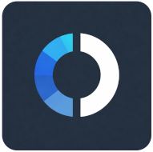

# &nbsp;&nbsp;Outline Apps&nbsp;&nbsp;

## Fork Purpose

This fork is focused on building a modified Android client with per-app VPN selection, so you can choose which installed applications are routed through the VPN.

The Android app in this fork is renamed to **Outline Select**.

Prebuilt Android releases can be downloaded from [Releases](../../releases) as APK files.

## Original Project Information

Outline makes it easy for anyone to create a VPN server, allowing you to share access to the free and open internet with those in need. **We have two core applications:**

&nbsp;&nbsp;&nbsp;&nbsp;&nbsp;&nbsp;**Outline Manager** ([`/server_manager`](server_manager)): A graphical user interface for managing Outline servers. It is available for Windows, macOS, and Linux. [You can install the manager here](https://getoutline.org/get-started/#step-1). See [`server_manager/README.md`](./server_manager/README.md) for more information.

&nbsp;&nbsp;&nbsp;&nbsp;&nbsp;&nbsp;**Outline Client** ([`/client`](client)): A cross-platform proxy client for Windows, macOS, iOS, Android, and Linux. The Outline Client is designed for use with the server deployed with the Outline Manager, but it is also fully compatible with any [Shadowsocks](https://shadowsocks.org/) server. [You can install the client here](https://getoutline.org/get-started/#step-3). See [`client/README.md`](./client/README.md) for more information.

## Community and Support

Interested in **contributing to Outline?** See our [Contributing Guide](CONTRIBUTING.md) for more information.

See [AGENTS.md](./AGENTS.md) for AI agent and developer guidance.

You can also **join the Outline Community** by signing up for the [IFF Mattermost](https://wiki.digitalrights.community/index.php?title=IFF_Mattermost)!

For customer support and to **contact us directly**, go to https://support.getoutline.org.
